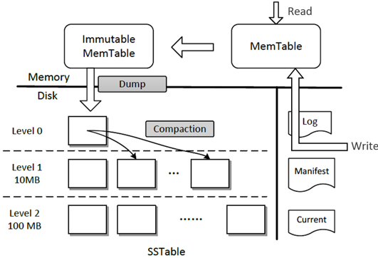

# Hackathon TiDB/TiKV 参考文档资料汇总

## 前序阅读

阅读本文档之前，需要首先对 TiDB 的架构和基本原理有了解，请确保阅读过以下几篇文章：

*   [TiDB 架构](https://zhuanlan.zhihu.com/p/25142743)

*   [讲存储](https://zhuanlan.zhihu.com/p/26967545)

*   [说计算](https://zhuanlan.zhihu.com/p/27108657)

*   [论调度](https://zhuanlan.zhihu.com/p/27275483)

*   [TiDB 源码阅读系列文章（二）初识 TiDB 源码](https://zhuanlan.zhihu.com/p/34176614)

*   [TiDB 源码阅读系列文章（三）SQL 的一生](https://pingcap.com/blog-cn/tidb-source-code-reading-3/)

## TiDB

TiDB 是集群的 SQL 层，承担了与客户端通讯（协议层）、语法解析（SQL Parser）、查询优化（Optimizer）、执行查询计划等工作。

###  Protocol Layer

TiDB 的协议兼容 MySQL，具体 MySQL 的协议细节可以参考 [MySQL Protocol](https://dev.mysql.com/doc/internals/en/client-server-protocol.html)。

### SQL Parser

TiDB 的 Parser 分为两块，第一部分是 Lexer，是用 Golang 手动写的；第二部分是 Parser，用 goyacc 实现。Parser 实现阅读这篇文章：[TiDB 源码阅读系列文章（五）TiDB SQL Parser 的实现](https://pingcap.com/blog-cn/tidb-source-code-reading-5/)，如果想要深入理解 yacc 的语法，推荐阅读 [《flex & bison》](https://book.douban.com/subject/3568327/)。

### Schema 管理 & DDL

TiDB 实现了 Google F1 的 [在线 Schema 变更算法](http://static.googleusercontent.com/media/research.google.com/zh-CN//pubs/archive/41376.pdf)，这个算法比较复杂，可以参考这篇[解读文章](https://github.com/zimulala/builddatabase/blob/master/f1/schema-change.md)。TiDB 的实现可以参考 [TiDB 的异步 schema 变更实现](http://zimulala.github.io/2016/02/02/schema-change-implement/)，源码解析可以参考：[TiDB 源码阅读系列文章（十七）DDL 源码解析](https://pingcap.com/blog-cn/tidb-source-code-reading-17/)

### 表达式

这篇 [为 TiDB 重构 built-in 函数](https://zhuanlan.zhihu.com/p/27528657) 文章，描述了如何利用新的计算框架为 TiDB 重写或新增 built-in 函数。

### SQL Optimizer

SQL 优化器大多数逻辑都在 [plan](https://github.com/pingcap/tidb/tree/master/planner) 这个包下，与之相关的还有统计信息以及 Range 计算模块。统计信息在下一章节描述。Range 计算在 [ranger](https://github.com/pingcap/tidb/tree/master/util/ranger) 包下。文章可以参考：

*   [TiDB 源码阅读系列文章（六）Select 语句概览](https://pingcap.com/blog-cn/tidb-source-code-reading-6/)

*   [TiDB 源码阅读系列文章（七）基于规则的优化](https://pingcap.com/blog-cn/tidb-source-code-reading-7/)

*   [TiDB 源码阅读系列文章（二十一）基于规则的优化 II](https://pingcap.com/blog-cn/tidb-source-code-reading-21/)

*   [TiDB 源码阅读系列文章（八）基于代价的优化](https://pingcap.com/blog-cn/tidb-source-code-reading-8/)

*   [TiDB 源码阅读系列文章（十二）统计信息(上)](https://pingcap.com/blog-cn/tidb-source-code-reading-12/)

*   [TiDB 源码阅读系列文章（十三）索引范围计算简介](https://pingcap.com/blog-cn/tidb-source-code-reading-13/)

*   [TiDB 源码阅读系列文章（十四）统计信息（下）](https://pingcap.com/blog-cn/tidb-source-code-reading-14/)

### 执行引擎

执行器由两部分组成，一部分在 [TiDB 端](https://github.com/pingcap/tidb/tree/master/executor)，另一部分在 [TiKV](https://github.com/pingcap/tikv/tree/master/src/coprocessor)(或 [Mock-TiKV](https://github.com/pingcap/tidb/tree/master/store/mockstore/mocktikv)) 中，Mock-TiKV 主要用来做单元测试，里面部分实现了 TiKV 的逻辑。

这部分的作用是严格按照物理算子的要求，处理数据，产生结果。[MPP and SMP in TiDB](https://pingcap.com/blog-cn/mpp-smp-tidb/) 这篇文章，介绍了一点执行器的架构。源码解析可以参考：

*   [TiDB 源码阅读系列文章（十）Chunk 和执行框架简介](https://pingcap.com/blog-cn/tidb-source-code-reading-10/)

*   [TiDB 源码阅读系列文章（九）Hash Join](https://pingcap.com/blog-cn/tidb-source-code-reading-9/)

*   [TiDB 源码阅读系列文章（十一）Index Lookup Join](https://pingcap.com/blog-cn/tidb-source-code-reading-11/)

*   [TiDB 源码阅读系列文章（十五）Sort Merge Join](https://pingcap.com/blog-cn/tidb-source-code-reading-15/)

*   [TiDB 源码阅读系列文章（二十二）Hash Aggregation](https://pingcap.com/blog-cn/tidb-source-code-reading-22/)

### TiKV Client

TiKV Client 是 TiDB 中负责跟 TiKV 交互的模块，这里会有两阶段提交，Coprocessor 交互等等。目前 TiKV Client 有两个语言的版本，第一个是 Golang 的，代码位置在 [store/tikv](https://github.com/pingcap/tidb/tree/master/store/tikv)。

这里有两个简单的例子，如何调用 ticlient 的 KV 接口：[benchkv](https://github.com/pingcap/tidb/tree/master/cmd/benchkv)， [benchrawkv](https://github.com/pingcap/tidb/tree/master/cmd/benchraw)

另一个版本是 Java 的，在 [tikv-client-lib-java](https://github.com/pingcap/tikv-client-lib-java) 中，主要是个 TiSpark 项目用。

Rust-client，在 [client-rust](https://github.com/tikv/client-rust)，目前功能还不是很丰富，大家可以尝尝鲜。

源码解析：

*   [TiDB 源码阅读系列文章（十八）tikv-client（上）](https://pingcap.com/blog-cn/tidb-source-code-reading-18/)

*   [TiDB 源码阅读系列文章（十九）tikv-client（下）](https://pingcap.com/blog-cn/tidb-source-code-reading-19/)

### 分布式事务

TiDB 支持分布式事务，实现原理参考自 [Percolator](http://research.google.com/pubs/pub36726.html)，是一个优化过的 2pc 算法。在 TiDB 中的实现参考 [Transaction in TiDB](https://andremouche.github.io/tidb/transaction_in_tidb.html)。原始的 Percolator 是一个[乐观的事务算法](https://pingcap.com/blog-cn/percolator-and-txn/)，在 3.0 里面 TiDB 引入悲观事务（实验性）特性，具体实现原理可以参考：[TiDB 新特性漫谈：悲观事务](https://pingcap.com/blog-cn/percolator-and-txn/)。

TiDB 侧的事务逻辑可以参考 [TiDB 源码阅读系列文章（十九）tikv-client（下）](https://pingcap.com/blog-cn/tidb-source-code-reading-19/)。

### TiDB 读写代码主流程

*   [TiDB SQL 写流程](https://docs.google.com/document/d/1sVpjMO6q9lhlOS3j4o81G_PxqDOSrO3EQsXJM3sV8gY/edit)

*   [TiDB SQL 读流程](https://docs.google.com/document/d/1ZDSNvGwbtp3f_pbLz9lSZxWFDdqp5HtyhCODHAPjXKM/edit)

## TiKV

这里有一个深入介绍 TiKV 原理的系列文章：[Deep Dive Into TiKV](https://tikv.github.io/deep-dive-tikv/overview/introduction.html)

这里有一个 [TiKV 源码解析系列文章](https://pingcap.com/blog-cn/#TiKV-%E6%BA%90%E7%A0%81%E8%A7%A3%E6%9E%90)

TiKV 内部可分为多层，每层有各自的功能，按从底向上排列：

*   RocksDB

*   Raft

*   Raft KV

*   MVCC

*   TXN KV

*   Coprocessor

RocksDB 是一个单机存储引擎，存放 TiKV 所有数据，提供单机存储的 KV API。[详情参见](https://docs.google.com/document/d/1pnmuX8LNRMyYCIq9gNVGExMmrZDpdzgj83GYsZisvBI/edit?ts=5d6f0952#heading=h.xptqrfst9mp)。

Raft 是一种一致性算法，在 TiKV 中代表了一致性层，使各个 TiKV 之间的状态能达成一致。负责 TiKV 副本之间的拷贝，是 TiDB 高可用的基石。[详情参见](https://docs.google.com/document/d/1pnmuX8LNRMyYCIq9gNVGExMmrZDpdzgj83GYsZisvBI/edit?ts=5d6f0952#heading=h.icrxj8syphn0)。

RaftKV 在 RocksDB 和 Raft 之上，结合两者，提供了分布式强一致性的基础 KV API。

MVCC 顾名思义，提供了多版本并发控制的 API，此外还提供了事务 API。MVCC 层通过对 key 进行特殊编码（编进 Timestamp）实现了多版本和事务。

TXN KV 在 RaftKV 和 MVCC 之上，结合两者，提供了分布式事务和多版本并发控制。TiDB会调用它的 API。

Coprocessor 负责处理 TiDB 下推的部分算子，在更靠近数据的地方，承担部分的计算逻辑。Coprocessor 在 RaftKV 和 MVCC 层之上。TiDB 会将查询转化成一个 DAG，DAG 包含了下推的表达式，Coprocessor 根据表达式计算 TiKV 中的数据，将计算结果返回给 TiDB。

## Placement Driver (PD) 

PD 在集群中的地位是一个逻辑上的单点，类似于很多系统中都有的 master server 或者 meta server 之类的组件。PD 的内部结构是多种不同功能的复合体，功能简介可以参考 [《PD 调度策略最佳实践》](https://pingcap.com/blog-cn/best-practice-pd/) 这篇文章，还有基于源码的介绍 [TiKV 源码解析系列 - Placement Driver](https://pingcap.com/blog-cn/placement-driver/) 和 [TiKV 源码浅析 - PD Scheduler](https://pingcap.com/blog-cn/pd-scheduler/)。

### embed etcd

[etcd](https://github.com/coreos/etcd) 是基于 raft 的分布式 kv 数据库，可以认为是简化版的 tikv，区别是只有一个 raft group，只能存少量数据。

PD 使用了 etcd 提供的 embed 功能，将 etcd 以 library 的方式内嵌进同一进程内，并将 PD 所需要的 HTTP 和 gRPC 服务绑定到 etcd 所监听的端口。

多个 PD 会使用 etcd 的接口选出一个 leader 提供服务，leader 失效时其他 PD 会选出新的 leader 进行服务。

### meta 管理及路由

PD 负责管理的元信息包括全局配置（clusterID，副本数等），tikv 节点的注册上下线，region 信息的创建等。

TiDB 要访问某个 region 的数据时，需要先向 PD 查询此 region 的状态和位置。各个 tikv 实例通过心跳把元信息同步给 PD，PD 将元信息缓存在本地，并要内存中组织成方便查询的结构来提供路由服务。

### Timestamp 分配

分布式事务模型需要全局有序的时间戳，PD leader 负责提供 TS 的分配，通过 etcd 来保证即使 leader 切换等状况下 TS 也保持单调递增。

### 调度

调度主要分为两方面。其一是副本管理（replica placement），需要为数据维护期望的副本数（比如有主机挂了要补充新的），还要满足一些约束条件，比如要保证多个副本尽可能隔离，或是分布到特定的 namespace 等。

另一方面是均衡负载（load rebalance）。需要通过调整 region leader 或 peer 的位置来均衡负载，这部分我们做了多种不同的策略来适应不同的业务场景。

### 一致性协议 (Raft)

“一致性”是分布式系统要解决的核心课题之一。从 1990 年 paxos 算法的提出开始，基于消息传递的一致性协议成为主流，[Raft](https://ramcloud.stanford.edu/~ongaro/thesis.pdf) 便是其中的一种。Raft 集群中的每个节点都处于以下三种状态：Leader，Follower 和 Candidate。在 Raft 协议的运行过程中，每个节点启动时都会进入 Follower 状态，并通过选举（Leader Election）产生一个新的 Leader。Raft 通过 term 的概念来避免脑裂，即任何一个 term 内，都有且只有一个 Leader。在产生 Leader 之后，对该 Raft 集群的读写请求都会走 Leader，其中，写请求的处理过程称为 Log Replication。Leader 除了会将客户端的写入请求持久化到自己的日志中之外，还会将日志同步给其他副本，也就是自己的 Follower，只有收到过半的确认之后，Leader 才会向客户端确认写入完成。之后，Raft 会将日志中的修改应用到自己的状态机中，这一步称为 Apply。这个机制同样适用于修改 Raft 集群本身的配置，比如添加节点、删除节点等。对于读请求，经典的 Raft 的实现与对写入请求的处理是完全相同的，但是可以有一些优化，例如 read index 和 read lease 等。

TiKV 使用 Raft 协议在 Rocksdb 的基础上再封装了一个 KV 引擎，通过这个引擎，对 TiKV 的写入便能够同步到多个副本上了，这样即使部分节点失败，集群仍然是可用的，并且数据仍然是一致的。

### 存储引擎 (LSM Tree & RocksDB)

[LSM tree](https://en.wikipedia.org/wiki/Log-structured_merge-tree) 是 Log-Structured Merge tree 的缩写，是一种写入速度很快的数据结构，所有的写入都是追加写入，包括插入、更新、删除。相应地，这是以牺牲一部分读取性能为代价的。这个 trade off 的背景是机械硬盘上顺序写入速度远高于随机写入，因此若所有写入操作都是顺序写入，则可以在机械硬盘上实现极高的写入效率。在 ssd 上由于顺序写入与随机写入差别没有那么大，因此优势便不那么显著。

LSM tree 通常由 write ahead log（WAL），memtable 和 sst files 三部分组成。WAL 的作用是保证写入的数据不会丢失，写入操作首先会将要写的内容 append 到 WAL。当写 WAL 完成之后，接下来就是写 memtable，为了优化 cache 以及实现无锁并发修改，memtable 通常实现为 skip list。当写入到 memtable 完成之后，一次写入就完成了。当 memtable 的数据量达到一定阈值之后，会将 memtable 的内容刷到盘上，以 sst (SSTable) 的格式存储下来。sst 会在后台进行 compaction 删除无用数据。

[LevelDB](https://github.com/google/leveldb) 是 Google 开源的一种典型的 LSM tree 实现。[RocksDB](https://github.com/facebook/rocksdb) 是由 Facebook 开源的基于 LevelDB 开发的高性能单机 KV 存储。RocksDB 在 LevelDB 的基础增加了 column families、delete range、多线程 compaction、prefix seek 、user defined properties 等高级特性，功能和性能都有很大提升。

RocksDB (LevelDB) 架构如下图所示，其中 memtable 在写满之后会转化为 immutable memtable 等待 dump 到磁盘上。

RocksDB (LevelDB) 架构

TiKV 使用 RocksDB 作为单机的持久化存储。[rust-rocksdb](https://github.com/pingcap/rust-rocksdb) 是对 RocksDB 进行的 rust 封装，TiKV 通过 rust-rocksdb 来操作 RocksDB。

由于 RocksDB 是在 LevelDB 基础上改进优化而来的，大部分 LevelDB 特性得以保留，因此阅读 LevelDB 相关资料对于了解 RocksDB 也是非常有帮助的。

Reference:

[http://catkang.github.io/2017/01/07/leveldb-summary.html](http://catkang.github.io/2017/01/07/leveldb-summary.html)

[https://draveness.me/bigtable-leveldb](https://draveness.me/bigtable-leveldb)

LSM Tree 有写放大 (Write Amplification) 和读放大 (Read Amplification) 的问题。在 SSD 上，减少写放大可以提升写入效率，有多篇论文对此进行优化：

WiscKey: [https://www.usenix.org/system/files/conference/fast16/fast16-papers-lu.pdf](https://www.usenix.org/system/files/conference/fast16/fast16-papers-lu.pdf)

PebblesDB: [http://www.cs.utexas.edu/~vijay/papers/sosp17-pebblesdb.pdf](http://www.cs.utexas.edu/~vijay/papers/sosp17-pebblesdb.pdf)

### 网络通讯（gRPC）

[gRPC](https://grpc.io/about/) 是由 Google 开源的一个高性能的 RPC 框架。它基于 HTTP2 协议，提供全双工的流式接口，支持负载均衡、健康检查和认证功能。目前支持的语言有 C++, go 等 10 多种。我们基于 [gRPC core](https://github.com/grpc/grpc/) 和 [rust futures](https://github.com/alexcrichton/futures-rs) 实现了一套 rust 的框架 —— [grpcio](https://github.com/pingcap/grpc-rs)。

### 调优工具

如果我们需要发现 TiKV 的性能瓶颈，我们首先要通过 Profile 工具来定位，这个给大家提供两个我们常用的 Profile 工具供大家参考。

*   TiKV [火焰图工具](https://github.com/pingcap/tidb-inspect-tools/blob/master/tracing_tools/perf/cpu_tikv.sh)

*   VTune [分析 hotspots 指南](https://software.intel.com/en-us/vtune-amplifier-help-hotspots-analysis)
